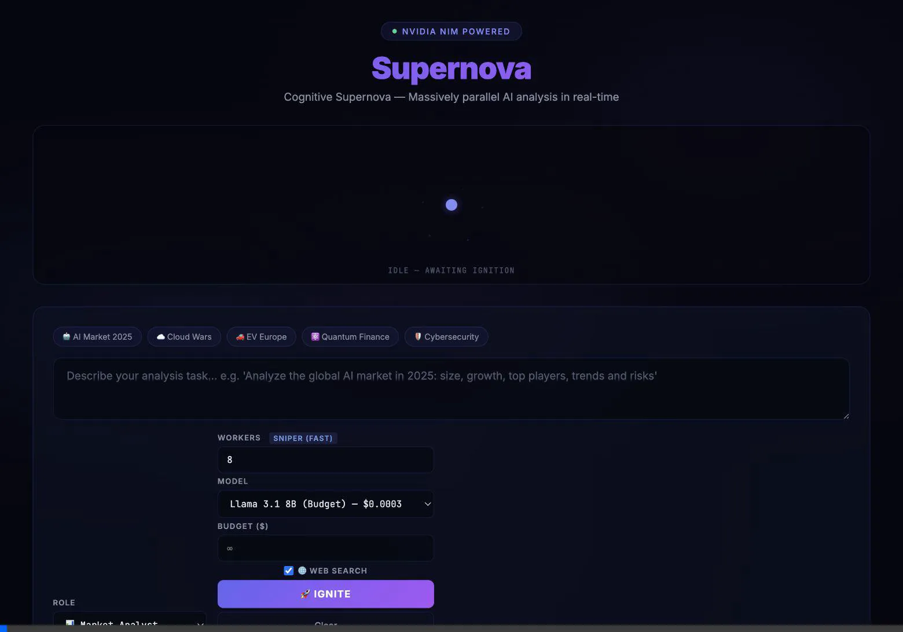
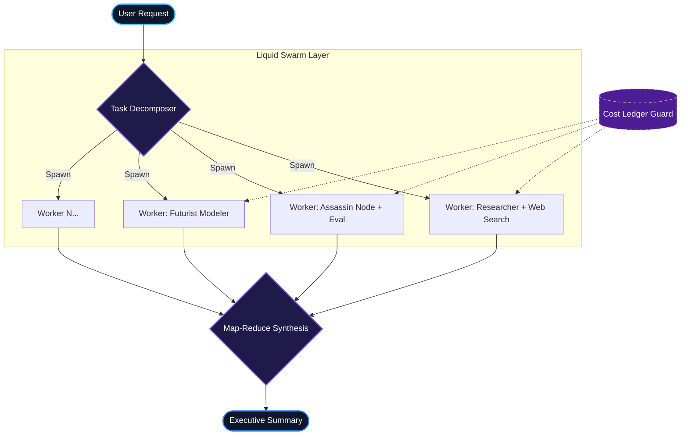
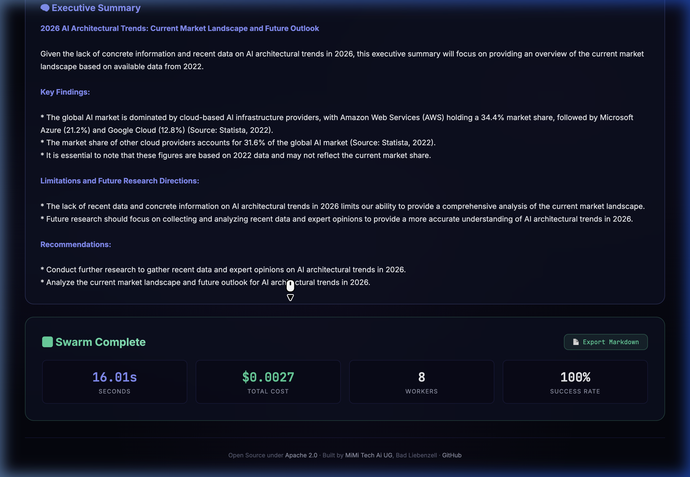

<div align="center">

# 🌌 SUPERNOVA

**Massively parallel, provider-agnostic Liquid Swarm AI architecture.**

[](https://opensource.org/licenses/Apache-2.0)
[](https://www.python.org/downloads/)
[]()
[]()

<br />



<br />

*Supernova is a next-generation orchestration engine that ignites a "cognitive supernova". It decomposes complex tasks, spawns dozens of specialized AI agents in parallel, grounds their knowledge in real-time, and collapses back to zero immediately when complete.*

</div>

---

## 🔥 Why Supernova? (2025/2026 Improvements)

Over the past two years, Supernova has evolved to solve the fundamental limits of single-agent systems.

*   **🌐 Real-Time Search Grounding (SAG):** Native DuckDuckGo web search integration prevents hallucinations. Agents actively scrape current internet data before answering.
*   **🔓 Zero Vendor Lock-in (Provider Agnostic):** Seamlessly switch between **OpenAI** (GPT-4o), **Anthropic** (Claude), **NVIDIA NIM**, and **Ollama** natively.
*   **🛡️ Enterprise Budget Guards (Cost Ledger):** Hard limits (e.g., $0.50 per run) track token usage globally. If the swarm exceeds the budget, execution halts cleanly. Never pay for a runaway agent again.
*   **🎯 Confidence Scoring:** Every worker evaluates its own reliability (`[CONFIDENCE: 95%]`). Results are visually mapped allowing humans to easily review edge cases.
*   **🧠 Map-Reduce Synthesis:** No more reading 50 disjointed answers. The Swarm channels all results into a final Synthesis Node that produces a perfect, cohesive Executive Summary.
*   **⚡ Reactive SSE Engine:** The entire execution lifecycle is streamed via Server-Sent Events—watch tasks decompose, agents spin up, and answers stream token-by-token in real-time.
*   **⚔️ Specialized Elite Nodes:** Leverage specialized roles like the **Futurist** for predictive modeling or the **Assassin** node for aggressively challenging weak arguments.

---

## 🏗️ The Liquid Swarm Architecture

The architecture relies on high-concurrency, isolated worker nodes functioning inside an asynchronous LangGraph execution ring. 



**Key Architectural Features:**
*   **Self-Healing Swarm:** If one node panics or hits an API timeout, the `N-1` workers persist. Exponential backoffs are built-in.
*   **Rate-Limit Immunity:** Asynchronous semaphores protect you from `HTTP 429 Too Many Requests` when talking to LLM providers.
*   **Stateless Scaling:** Entirely stateless nodes allow infinite scaling through Docker or Kubernetes.

---

## 🚀 Quick Start

### 1. Requirements

*   Python 3.12+
*   [uv](https://docs.astral.sh/uv/) (Extremely fast Python package manager)
*   At least one active API Key (OpenAI, Anthropic, NVIDIA) or local Ollama.

### 2. Setup

```bash
# Clone the repository
git clone https://github.com/mimitechai/supernova.git
cd supernova

# Install dependencies extremely fast with uv
uv sync --all-extras
```

### 3. Configuration 

Create a `.env` in the root:

```env
# Which provider should drive the swarm?
LLM_PROVIDER=openai

# API Keys
OPENAI_API_KEY=sk-...
ANTHROPIC_API_KEY=sk-ant-...

# Hard monetary guard (e.g. max $0.50 per swarm ignition)
COST_BUDGET_PER_RUN=0.50
```

### 4. Ignite

Start the ASGI web server backend:

```bash
uv run python -m web.app
```



Navigate your browser to **http://localhost:8000** to command the swarm.

---

## 🛳️ Enterprise Deployment (Docker)

Supernova is production-ready out of the box with `docker-compose`.

```bash
# Build and run the entire suite in detached mode
docker-compose up -d --build
```
*Auto-saves and persists run histories via volume mounts.*

---

## 🧪 Bulletproof Testing

Supernova uses TDD heavily for routing, limit verification, and edge-case resilience.

```bash
uv run pytest -v
uv run pytest --cov=liquid_swarm --cov-report=term-missing
```

---

## 🤝 Contributing

1. Fork it!
2. Create your feature branch (`git checkout -b feature/FuturistUpgrades`)
3. Ensure TDD tests pass (`uv run pytest`)
4. Commit your changes (`git commit -m 'feat: Enhance Futurist Model'`)
5. Push your branch (`git push origin feature/FuturistUpgrades`)
6. Open a Pull Request!

---

<div align="center">
  <sub>Built with 🩵 by <a href="https://mimitech.ai">MiMi Tech Ai UG</a>, Bad Liebenzell, Germany.</sub><br />
  <sub>Copyright © 2026. Distributed under the Apache License 2.0.</sub>
</div>
