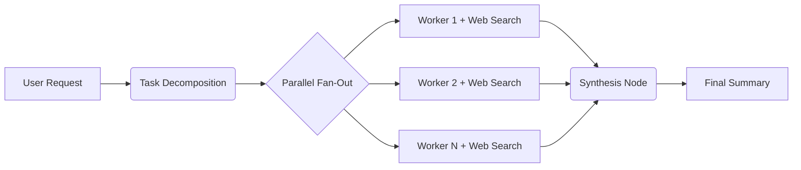

# Supernova 🌌

> **Massively parallel, provider-agnostic AI agent orchestration framework.**

Supernova (powered by Liquid Swarm architecture) is a high-performance orchestration engine that breaks down complex research, coding, and analysis tasks into dozens of micro-tasks. It spawns specialized AI agents in parallel to solve them, grounds their answers using live web search, and synthesizes the results into a cohesive, highly accurate executive summary.

At rest, Supernova consumes zero resources. When tasks arrive, it ignites a "cognitive supernova," parallelizing workloads and collapsing back to zero when complete.

[](https://opensource.org/licenses/Apache-2.0)
[](https://www.python.org/downloads/)
[]()

---

## 🎯 Key Capabilities

*   **🌐 Real-Time Data Grounding (SAG Pipeline):** Built-in DuckDuckGo web search integration. Workers actively retrieve current data from the live internet, preventing AI hallucinations. Citations and domain sources are transparently exposed in the UI.
*   **🔓 Zero Vendor Lock-in (Provider Agnostic):** Native support for **OpenAI** (GPT-4o), **Anthropic** (Claude), **NVIDIA NIM** (Llama 3, Mixtral), and **Ollama** for 100% local, privacy-first execution.
*   **🛡️ Enterprise Safety & Budget Guards:** Set hard budget limits before execution. The engine tracks token usage per agent and halts execution automatically if the budget is exhausted, preventing runaway costs.
*   **📊 Confidence Scoring:** Every worker evaluates the reliability of its own answer (e.g., `[CONFIDENCE: 90%]`). Outputs are color-coded in the UI so human reviewers instantly know where verification is needed.
*   **⚡ Reactive Live UX:** The entire execution lifecycle is streamed via Server-Sent Events (SSE). Watch the swarm decompose tasks, spin up workers, and stream the final synthesis token-by-token.
*   **🧠 Dynamic Context Injection:** Workers receive the complete original context (e.g., thousands of lines of code) alongside their specific sub-task, enabling them to perform deep, contextual tasks like Code Reviews and Legal Analysis out-of-the-box.

---

## 🏗️ Architecture



**Design Highlights:**
*   **LangGraph Backend:** Uses `Send()` API for true parallel supersteps.
*   **Rate Limiting:** Asynchronous semaphores prevent API throttling (HTTP 429).
*   **Fault Isolation:** If one worker times out or fails, the remaining N-1 workers complete successfully. The swarm is self-healing.
*   **TDD Solidified:** Over 70+ test cases ensuring routing, edge cases BDD scenarios, cost limits, and search APIs behave deterministically.

---

## 🚀 Quick Start

### 1. Prerequisites
*   Python 3.12+
*   [uv](https://docs.astral.sh/uv/) (Extremely fast Python package manager)
*   At least one API key (OpenAI, Anthropic, NVIDIA) OR Ollama running locally.

### 2. Installation

Clone the repository and install all dependencies:
```bash
git clone https://github.com/mimitechai/supernova.git
cd supernova
uv sync --all-extras
```

### 3. Configuration

Create a `.env` file in the root directory. Configure your preferred providers:

```env
# Choose your default provider: openai, anthropic, nvidia, or ollama
LLM_PROVIDER=openai

# API Keys (Only the one for your active provider is required)
OPENAI_API_KEY=sk-your-key-here
ANTHROPIC_API_KEY=sk-ant-your-key-here
NVIDIA_API_KEY=nvapi-your-key-here

# Optional: Set a hard budget limit per run (in USD)
COST_BUDGET_PER_RUN=0.50

# Optional: For advanced Search APIs (Defaults to free DuckDuckGo if omitted)
TAVILY_API_KEY=tvly-your-key-here
```

### 4. Ignite the Swarm

Start the ASGI web server:
```bash
uv run python -m web.app
```
Navigate to **http://localhost:8000** in your browser to access the Supernova command center.

---

## 🧪 Testing

The test suite covers everything from API rate limiting to BDD scenarios and web search mocking.

```bash
# Run the fast unit test suite 
uv run pytest -v

# Run with coverage report
uv run pytest --cov=liquid_swarm --cov-report=term-missing
```

---

## 🤝 Contributing

We welcome contributions to make Supernova even more powerful! 

1. Fork the project.
2. Create your feature branch (`git checkout -b feature/AmazingFeature`).
3. Ensure TDD tests pass (`uv run pytest`).
4. Commit your changes (`git commit -m 'feat: Add some AmazingFeature'`).
5. Push to the branch (`git push origin feature/AmazingFeature`).
6. Open a Pull Request.

---

## 📄 License

Copyright 2026 [MiMi Tech Ai UG](https://mimitech.ai), Bad Liebenzell, Germany.

Distributed under the Apache License 2.0. See `LICENSE` for more information.
